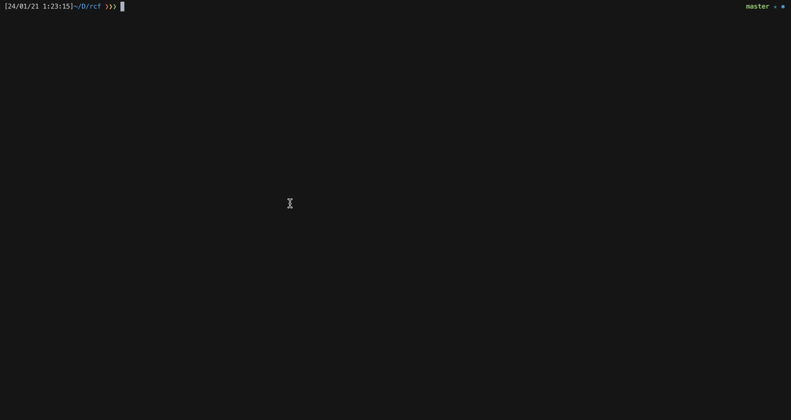

# rcf

rcf is an cli application that helps you traverse and fuzzy search through your zsh history to edit or execute a command.

### Usages

1. Install rcf via cargo `cargo install rcf`
1. Append `rcf.zsh`to `~/.zshrc` (source this file again or open a new zsh). You can edit your key binding as you wish, by default `rcf` is binded to Ctrl + R.
1. `Ctrl + R` and enjoy `rcf`
	- Using `Ctrl + n/p` to traverse the commands list
	- `Enter` to copy and edit the selecting command
	- `Ctrl + e` to execute the selecting command
	
### Limitations

- Haven't supported traverse using arrow keys
- Haven't supported `Ctrl + Enter` to execute the command
- Haven't supported other shells
- The fuzzy search hasn't refined tunining